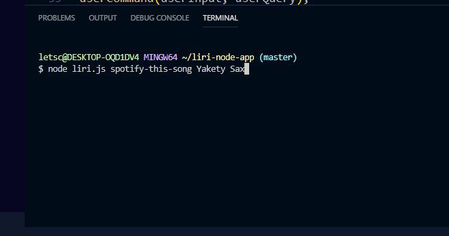

# Liri Node Application

## Homework for Week 10

This app takes the User's Queries to search for concerts, songs, movies or to read from a pre rendered txt file.

- **Please install these npm packages before getting started**

  - npm init -y
  - npm i node-spotify-api
  - npm i dotenv
  - npm i axios
  - npm i moment

- Use the command **concert-this** to use the bandsintown API to find where and when a ban is playing.

  - _This is a sample input of that command_
    
  - _This is a sample output of that command_
    

- Use the command **movie-this** to use the OMDB API to find information on a film.

  - _This is a sample input of that command_
    
  - _This is a sample output of that command_
    

- Use the command **spotify-this-song** to use the spotify API to find information on a song

  - _This is a sample input of that command_
    
  - _This is a sample output of that command_
    

- Use the command **do-what-this-says** to read from the random.txt file
  - _This is a sample input of that command_
    
  - _This is a sample output of that command_
    
